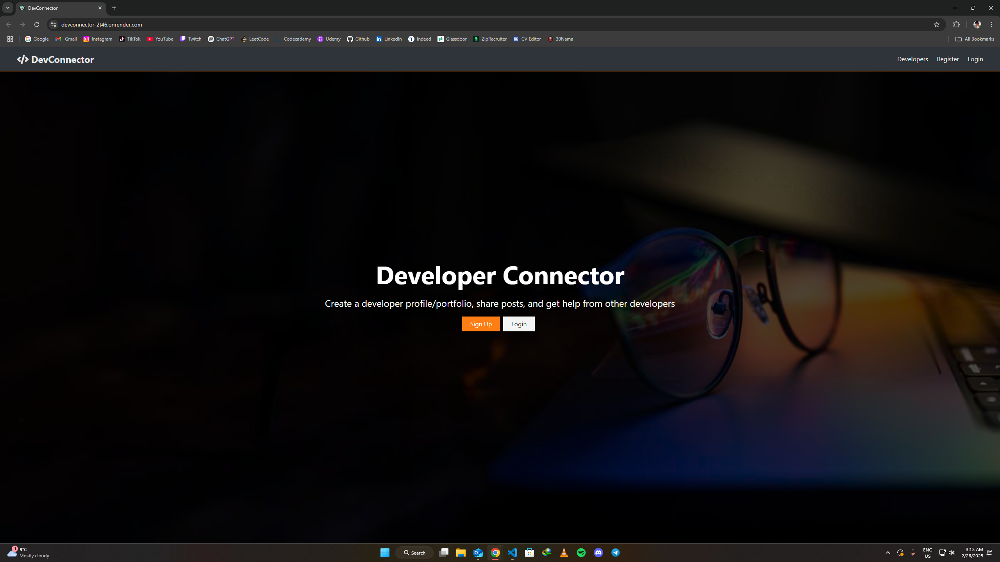

#

DevConnector

> Social network for developers, built on the MERN stack.
>
> <!--Live demo [_here_]().  If you have the project hosted somewhere, include the link here. -->

## Table of Contents

- [General Info](#general-information)
- [Technologies Used](#technologies-used)
- [Screenshots](#screenshots)
- [Usage](#usage)
- [Project Status](#project-status)
- [Room for Improvement](#room-for-improvement)
- [Acknowledgements](#acknowledgements)
- [Contact](#contact)
<!-- * [License](#license) -->

## General Information

A Social network for developers, where you can create a developer profile/portfolio, share posts, and get help from other developers.

- This Project was deployed using: [Render](https://render.com)

<!-- You don't have to answer all the questions - just the ones relevant to your project. -->

## Technologies Used

- npm - 10.9.2
- React.js - 17.0.2
- Redux - 7.2.6
- redux-thunk - 2.4.0
- uuid - 8.3.2
- HTML - version html5
- CSS
- babel
- Axios - 1.7.9
- AJAX
- git version 2.38.1.windows.1
- github
- Express - 4.21.2
- express-validator - 7.2.0
- MongoDB - 6.12.0
- mongoose - 8.9.1
- bcryptjs - 2.4.3
- config - 3.3.12
- dotenv - 16.4.7
- gravatar - 1.8.2
- jsonwebtoken - 9.0.2
- normalize-url - 4.5.0
- request - 2.88.2
- Render

## Screenshots

## Usage

This is a Social network for developers. You can create a developer profile/portfolio, share posts, and get help from other developers.

The app should have the following features:

- **Frontend** - Neat and User-Friendly component based Frontend, created with React and deployed using Render
- **Backend API** - JS-based API, Properly implementing routes and database connection, deployed using Render
- **Secure & Authenticated Links** - Most of the API routes are secured and cannot be accessed without proper Authentication
- **Storage** - Utilize MongoDB database for storage, Hosted on MongoDB Cloud

## Project Status

Project is: Complete

## Room for Improvement

- Frontend: I was thinking of adding an edit button inside the actions columns of both [Education](/client/src/components/dashboard/Education.js) and [Experience](/client/src/components/dashboard/Experience.js) which would need a profile-form component to be created for each one, similar to what I have for [CreateProfile](/client/src/components/profile-forms/CreateProfile.js) and [EditProfile](/client/src/components/profile-forms/EditProfile.js).

- Backend: There would need to be routes created for editing profile education and experience inside the [Profile](/routes/api/profile.js) API Route in order to complement the frontend changes.

## Acknowledgements

- Many thanks to Udemy & Brad Traversy for including this project on their MERN Stack Front To Back: Full Stack React, Redux & Node.js Course.

<!-- Optional -->
<!-- ## License -->
<!-- This project is open source and available under the [... License](). -->

<!-- You don't have to include all sections - just the one's relevant to your project -->
